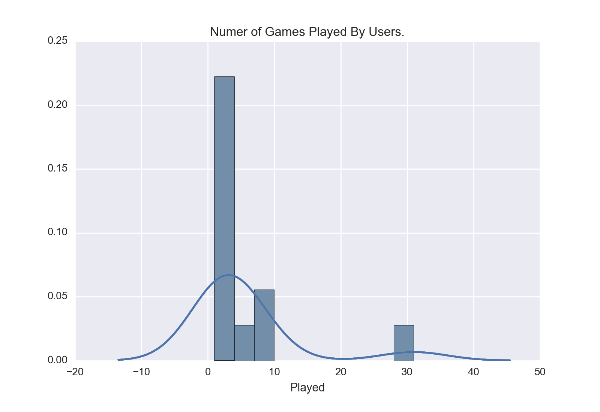

# bsa_analysis
A bunch of scripts where I analyze my battleship application.
Some of the interesting data I want to extract is the CPU vs User breakdown and what the win-loss
ratio is. I also think it's interesting to get the user who has the highest win percentage based on
wins and total games played.

I plan on having fun disecting the data and finding potential correlations just for fun & other insights
as well.

# Purpose
Solidfying and honing my skills with `pandas`, `SQLalchemy` and for the pure enjoyment of munging data and
turning it into something beautiful.

# Histogram of total games player by all users.
This graph shows that most users who played the battleship app normally play between 1-10 times before
not playing anymore. There a couple of edge cases but for the most part that's what the average player
will do.

