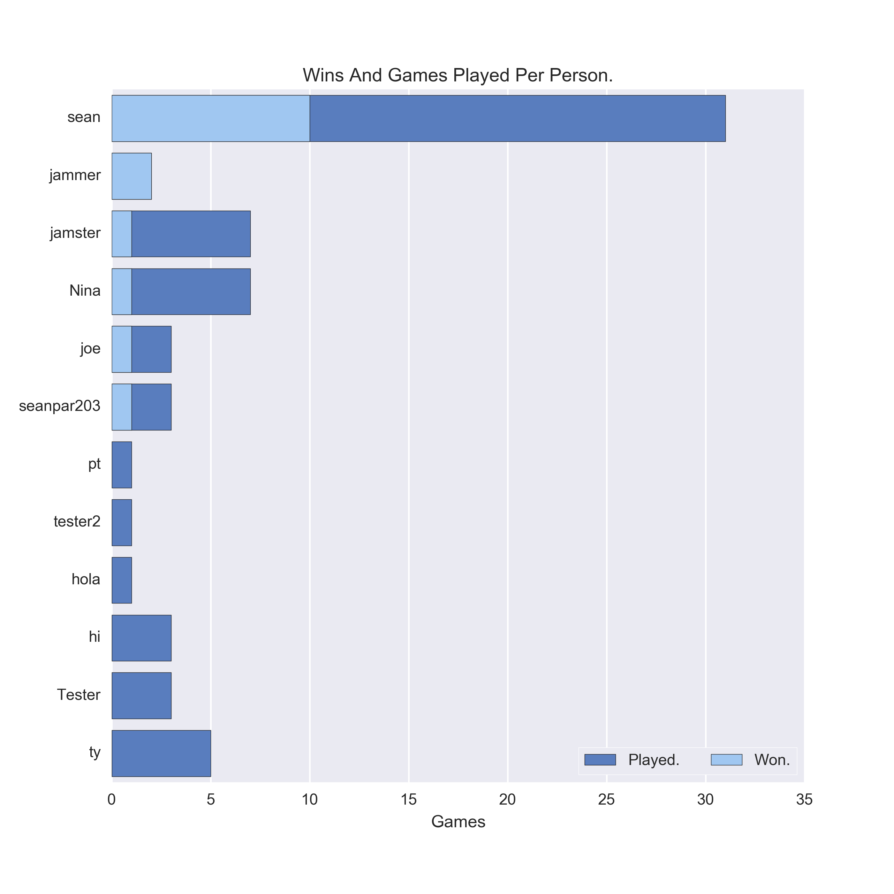
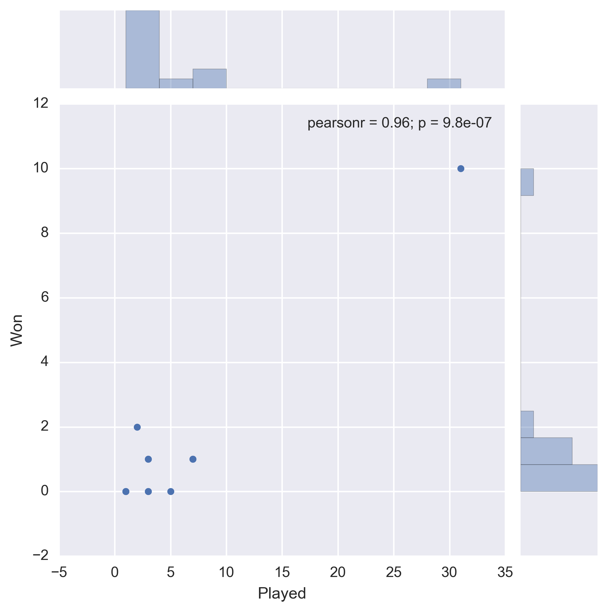

# bsa_analysis
A bunch of scripts where I analyze my battleship application.
Some of the interesting data I want to extract is the CPU vs User breakdown and what the win-loss
ratio is. I also think it's interesting to get the user who has the highest win percentage based on
wins and total games played.

I plan on having fun disecting the data and finding potential correlations just for fun & other insights
as well.

# Purpose
Solidfying and honing my skills with `pandas`, `SQLalchemy` and for the pure enjoyment of munging data and
turning it into something beautiful.

# Total games played by all users.
This graph shows that most users who played the battleship app normally play between 1-10 times before
not playing anymore. There a couple of edge cases but for the most part that's what the average player
will do.

# Player wins and total games.
These graphs repsent the total games played and the total games won. The bar provides a simplier look
but the scatter plot provides much more insightful information by further showing the correlation of
total games played and total wins.

The CPU is hard to beat, The highest win percentage is around 33%. I also didn't add a column on the `game`
table to verify the user actually completed the game, that would've helped get a more accurate CPU vs User
breakdown.

